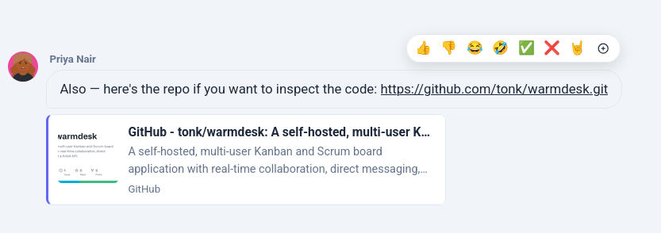
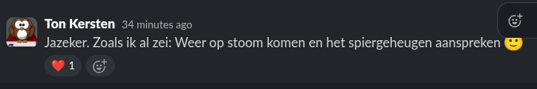

# WarmDesk — User Guide

## Contents

1. [Getting Started](#1-getting-started)
2. [The Interface](#2-the-interface)
3. [Projects](#3-projects)
4. [Kanban Board](#4-kanban-board)
   - [4b. Scrum Board](#4b-scrum-board)
5. [Cards](#5-cards)
6. [Topics](#6-topics)
7. [Chats & Direct Messages](#7-chats--direct-messages)
8. [Notifications & @Mentions](#8-notifications--mentions)
9. [Time Reports](#9-time-reports)
10. [Time Tracking](#10-time-tracking)
11. [Helpdesk](#11-helpdesk)
12. [User Settings](#12-user-settings)
13. [Customers](#13-customers)
14. [Search](#14-search)

---

## 1. Getting Started

### Registering

Open your WarmDesk URL in a browser. If public registration is enabled you will
see a **Register** link on the login page. Fill in a username, display name,
email address, and password and click **Register**. You are logged in
immediately.

If registration is not available, ask an administrator to create an account for
you (see the [Admin Guide](admin-guide.md)).

### Logging in

Enter your username and password. WarmDesk issues a short-lived JWT access
token (15 minutes) and a 7-day refresh token that is used silently to keep you
logged in as long as your browser tab is open.

### Forgotten password

Click **Forgot password?** on the login page and enter your email address. If an
account with that address exists, a reset link is sent immediately. The link is
valid for **one hour**. Click it to open the password reset form, enter and
confirm your new password, and then log in normally.

If you do not receive the email, check your spam folder and confirm that your
account has a valid email address. Password reset requires SMTP to be configured
by your administrator.

### Session timeout

By default the session expires after **60 minutes of inactivity**. Any
interaction with the page (navigation, clicks, API calls) resets the timer. The
administrator can change this timeout or disable it entirely.

---

## 2. The Interface

### Sidebar

The collapsible sidebar on the left (or right — configurable in User Settings)
contains:

| Section | Contents |
|---------|----------|
| **Favorite Projects** | Your pinned projects — drag to reorder |
| **Projects** | All projects you belong to; starred ones appear at the top with a star icon |
| **Favorite Customers** | Customers you have starred — drag to reorder; click ★ to unstar |
| **All Customers** | Customers you have been assigned to, with starred ones shown first |
| **Favorite People** | Users you have marked as favourite — drag to reorder |
| **People** | Users currently connected; click a name to open a direct message |
| **Chats** | Your 8 most recent conversations with unread indicators |

All sections are drag-to-reorder (grab the ⠿ handle on the section header). Drag the inner edge of the sidebar to resize it — width and section order are persisted in your browser.

### Header

The header has three zones:

| Zone | Contents |
|------|----------|
| **Left** | WarmDesk logo — click it to go to the dashboard |
| **Center** | Global search bar |
| **Right** | Theme toggle (☀️ light / 🌙 dark / 🖥 system), language selector, user avatar |

Click the **avatar** to open a dropdown menu with links to the dashboard,
settings, admin panel (admins only), chats, time reports, and **Logout**.

### Footer

Displays the application name and version number on the left, and your full
display name on the right.

### Themes

WarmDesk supports **Light**, **Dark**, and **System** (follows your OS
preference) themes. Change the theme in User Settings at any time.

---

## 3. Projects

### Filtering projects by customer

When your projects belong to multiple customers, a **customer selector** appears
in the top-right of the dashboard (next to **+ New Project**). Choose a customer
to show only their projects; choose **All Customers** to go back to the full
list. The selector is hidden when all visible projects belong to a single
customer.

### Creating a project

Click **+ New Project** on the dashboard. Fill in:

| Field | Notes |
|-------|-------|
| **Name** | Required. The project's display name. |
| **Card Prefix** | 1–10 uppercase letters or digits (e.g. `PRJ`). Auto-generated from the name but freely editable before saving. Must be unique across all projects. Used in all card references like `PRJ-42`. **Cannot be changed after the project is created.** |
| **Description** | Optional free-text summary. |
| **Colour** | Accent colour shown on the dashboard tile and board toolbar. |

The live preview next to the Card Prefix field shows what card references will look like (e.g. `PRJ-1`).

### Project members

Open **Project Settings → Members** to invite team members. Select a user from
the dropdown and choose their role:

| Role | Permissions |
|------|-------------|
| **Viewer** | Read board, cards, topics, and chat. Cannot create or modify anything. |
| **Member** | All viewer permissions plus: create/edit/move cards, post comments, chat. |
| **Admin** | All member permissions plus: manage columns (create, rename, reorder, delete). |
| **Owner** | All admin permissions plus: manage members and webhooks, delete the project. |

Global administrators can do everything regardless of project role.

### Starring a project

Click the star icon next to a project name in the sidebar or on the project
board to pin it to the **Favorite Projects** section. Click again to unstar.

### Project settings

The gear icon on the board toolbar (visible to project admins and owners) opens
**Project Settings**, which has tabs for:

- **General** — rename or delete the project
- **Members** — invite, change roles, remove members
- **Labels** — create and manage card labels for this project
- **API Keys** — generate API keys for the Ticket API
- **Webhooks** — set up git platform integrations (see the [API Reference](api.md))

---

## 4. Kanban Board

### Columns

Each project has one or more columns (e.g. Backlog, In Progress, Done).
Project admins can:

- **Rename** a column by clicking its title
- **Add** a column with the **+ Add Column** button
- **Reorder** columns by dragging the column header
- **Delete** an empty column using the trash icon that appears when the column
  has no cards

### Cards in columns

Cards are shown as tiles within each column. Each tile shows the card title,
labels, priority indicator, due date, assignee avatars, and a checklist
completion counter if the card has checklist items.

### Sorting cards

Use the sort controls at the top of any column to order cards by:
- **Date** (creation date) — ascending or descending
- **Assignee** — alphabetical by display name
- **Priority** — critical → high → medium → low → none

### Moving cards

Drag a card to a different column or a different position within the same
column. All connected users see the move reflected instantly.

### Gantt chart

Click the **📅 Gantt** button in the board toolbar to open the project's
timeline view. Any card that has a start date or a due date appears as a
horizontal bar. Cards without dates are hidden.

| Control | Action |
|---------|--------|
| Day / Week / Month buttons | Zoom level |
| Click a bar | Open the card detail |
| Drag a bar | Not supported — edit dates in the card detail |

Return to the board with the breadcrumb at the top of the page.

### Charts

Click the **📊 Charts** button in the board toolbar to open the project's
analytics view. Available charts depend on the board type.

**Kanban boards:**

| Chart | What it shows |
|-------|---------------|
| **CFD** (Cumulative Flow Diagram) | Daily card counts per column over the selected period. A widening band for a column signals growing WIP or a blocked stage. |
| **Cycle Time** (Control Chart) | Scatter plot of how long each card spent open, plotted by close date, with a 7-day rolling average line to reveal trends. |
| **Lead Time** | Distribution of total time from card creation to closure, bucketed by duration. |
| **Throughput** | Number of cards closed per week — a direct measure of delivery rate. |

**Scrum boards** include all of the above plus:

| Chart | What it shows |
|-------|---------------|
| **Velocity** | Committed vs completed story points per sprint — shows delivery consistency over time. |
| **Burndown** | Remaining story points per day within a sprint against the ideal line. |
| **Burnup** | Cumulative completed points vs total scope per day within a sprint. |
| **Sprint Report** | Post-sprint breakdown: which cards were completed, which were not, with story-point totals and a completion percentage. Select any sprint from the dropdown. |
| **Epic Burndown** | Remaining cards (and story points) per day for a single epic, from epic creation to today, with an ideal line. Select an epic from the dropdown. |
| **Release Burndown** | Combined burndown across all sprints linked to a release. |

Use the time-range selectors at the top of each chart to zoom in or out.
Hover over any data point to see the exact values.

---

## 4b. Scrum Board

Projects created with the **Scrum** board type get a full sprint-planning workflow alongside the standard Kanban board. Switch between views using the toolbar buttons.

### Epics

Epics are named milestones that group related cards — similar to themes or features that span multiple sprints.

Open the **⚡ Epics** view from the board toolbar to manage epics:

- **Create** an epic with a name, description, colour, and status (Open / Done).
- **Reorder** epics by dragging the ⠿ handle.
- **Expand** an epic (click **▸**) to see its cards inline — click any card to open the full detail.
- **Edit or delete** an epic using the action buttons on the right.

A card belongs to at most one epic. To assign a card to an epic, open the card detail and select the epic from the **Epic** dropdown — the assignment saves immediately.

Cards on the board display a thin **colour bar** across the top and a small **epic name badge** when they belong to an epic. In the Backlog, each card shows its epic badge alongside the sprint selector. Use the **filter dropdown** in the Backlog header to show only cards from a specific epic (or cards with no epic).

### Product Backlog

Open the **📋 Backlog** view from the board toolbar. The left panel lists all open cards that are not assigned to a planning or active sprint.

- **Drag cards** using the ⠿ handle to change their priority order — the new order is saved automatically.
- **Assign a card to a sprint** using the sprint dropdown on each card.
- **Filter by epic** using the dropdown in the panel header.

### Sprints

The right panel of the Backlog view shows all sprints. Project members can:

| Action | How |
|--------|-----|
| Create a sprint | **+ New Sprint** button (top-right of the Sprints panel) |
| Edit name, goal, or dates | **Edit** button on the sprint header |
| Reorder sprints | Drag the ⠿ handle on the sprint header |
| Sort sprints | Click the **△▽** button to sort ascending or descending by sprint number; click again to return to custom order |
| Start a sprint | **Start** button (planning sprints only) |
| Complete a sprint | **Complete** button (active sprint only); unfinished cards return to the backlog |
| Remove a card from a sprint | **✕** button on the card row |

Only one sprint can be active at a time.

### Sprint Board

Click **🏃 Sprint Board** in the toolbar to see only the cards in the active sprint, arranged in your project columns. Use it like a regular Kanban board during the sprint.

### Sprint Report

After a sprint ends, open **📊 Charts → Sprint Report** and select the sprint to see:

- A summary bar with committed cards/points, completed cards/points, and a completion percentage.
- A table of **completed** cards (highlighted in green).
- A table of **not-completed** cards (highlighted in amber), showing which column each card was left in.

---

## 5. Cards

### Creating a card

Click **+ Add Card** at the bottom of any column. Enter a title and press Enter
or click **Add**.

### Card reference

Every card has a unique reference in the format `PREFIX-NUMBER` (e.g. `PRJ-42`).
This reference appears as a badge at the top of the card detail. Use it in
commit messages and pull request titles to automatically link git events to the
card (see [Git Integration](api.md#git-platform-webhooks)).

### Card detail

Click a card to open its detail panel. The panel is resizable. Fields:

| Field | Notes |
|-------|-------|
| **Title** | Plain text |
| **Description** | Markdown editor with toolbar, emoji picker, and @mention autocomplete |
| **Priority** | None / Low / Medium / High / Critical |
| **Start date** | Optional start date; used by the Gantt chart |
| **Due date** | Displayed in your configured date format. Type a date directly or click the calendar icon (📅) to open the native date picker. Clear the field to remove the due date. |
| **Time Spent** | Hours and minutes; contributes to time reports |
| **Story Points** | Scrum estimation value (whole number); only visible when an administrator has enabled **Scrum Story Points** in Admin → Settings |
| **Assignees** | Multiple assignees — click a name to toggle |
| **Labels** | Click a label chip to toggle; labels are project-specific |
| **Tags** | Free-form hashtags; type and press Enter or comma |
| **Watchers** | Subscribe to receive mention notifications on this card |
| **Sub-cards** | Child tasks nested under this card (one level deep); each has its own card number, assignees, labels, and comments; a progress bar shows how many are closed |
| **Linked cards** | Cards from any project linked as cross-references; shows reference, title, and current column |
| **Attachments** | Upload files by clicking or dragging; images display inline |
| **Checklist** | Add, check off, edit, and remove items; drag the ⠿ handle to reorder; a progress bar shows completion %; updates sync in real time across all viewers |
| **Git Links** | Commits, pull requests, and issues linked via webhooks (auto-populated) |
| **Comments** | Markdown, @mentions, and reply quoting |
| **Column history** | Log of every column transition |

### Writing in the card editor

The description and comment fields are plain text areas that support
**Markdown**. Markdown is rendered in read-only / preview mode. Native browser
spellcheck is active while typing.

| Feature | How to use |
|---------|------------|
| **Markdown** | Type normally; rendered on save / when another user views the card |
| **Insert emoji** | Click the 😊 button above the field |
| **@mention** | Type `@` followed by a username; a dropdown suggests matching members |

### Checklist

In the card detail scroll to **Checklist** and type an item, then press Enter
or click **Add Item**. Check items off as they are completed. A progress bar at
the top of the section shows how many items are done. Edit an item by clicking
the pencil icon; delete it with the ×.

Drag the **⠿** handle on the left of any item to reorder the list. Changes are
saved immediately and reflected in real time for anyone else viewing the same
card.

### Attachments

Drag files onto the upload zone or click it to open a file picker. Multiple
files can be uploaded at once. Images are displayed inline with a link to the
full-size version; other files appear as download links with their file name and
size.

### Git Links

When a commit message or pull request / issue title contains a card reference
(e.g. `PRJ-42`), WarmDesk creates a link automatically. Each link shows:

- **Platform badge** — GitHub, GitLab, Gitea, or Forgejo
- **Type** — Commit, Pull Request, or Issue
- **Short reference** — first 7 characters of the SHA for commits, or `#number`
  for PRs and issues
- **Title** — the commit message first line or PR / issue title
- **Status badge** — Open (green), Closed (red), or Merged (purple)

Click any row to open the original event in your git platform.

### Comments

Type in the **Add Comment** editor at the bottom of the card detail. Comments
support full Markdown. To reply to a comment, click the **Reply** button below
it — the comment is quoted automatically.

Use `@username` to mention a project member. If they are online they receive an
instant popup notification; offline they receive an email.

### Sub-cards

Scroll to the **Sub-cards** section in the card detail. Type a title and press
Enter or click **Add**. Each sub-card gets its own card number and can be
opened to set assignees, labels, and comments. Check the checkbox on a sub-card
to mark it closed. A progress bar at the top of the section shows done/total.

Sub-cards are not shown on the Kanban board — only inside the parent card's
detail view.

When a sub-card is open, a **← [parent card title]** link appears at the top
of the modal. Click it to close the sub-card and return to the parent card.

### Linked cards (cross-references)

Scroll to **Linked Cards** in the card detail. Type a card reference
(e.g. `PRJ-42`) in the input field and press Enter to link it. The linked card
appears with its reference, title, and current column. Cards from other projects
you have access to can also be linked. Click **✕** to remove a link.

Click the **↗** button on any linked card to open it in a nested modal. A
**← [source card title]** link at the top of that modal returns you to the
card you came from.

### Customising visible sections

The card detail can get busy. Click the **⋮** button in the top-right corner of
the card to open the sections menu. Each of the seven optional sections can be
toggled on or off:

| Section | Hidden by default |
|---------|-------------------|
| Labels | Yes |
| Tags | Yes |
| Attachments | Yes |
| Checklist | Yes |
| Sub-cards | Yes |
| Linked Cards | Yes |
| Watchers | Yes |

A section can only be turned off when it is **empty** — if a section contains
data the toggle is disabled and the section stays visible. When data is added to
a hidden section it becomes visible automatically.

Your preferences are saved in the browser and apply to every card you open.

### Copy card

Click **Copy Card** in the card detail footer to duplicate the card in the same
column. The copy gets a new card number. Labels, assignees, and checklist items
are copied; comments and attachments are not.

### Transfer card

Click **Transfer** in the card detail footer to copy or move the card to a
different project or column. Choose the destination project and column from the
dropdowns, then click **Copy** or **Move**. Move also removes the card from its
original column.

### Close / reopen a card

Click **Close Card** in the card detail footer to mark a card as done. Closed
cards remain on the board with a strikethrough style and a "Closed" badge.
Click **Reopen Card** at any time to restore it to open status.

### Saving

Click **Save** in the card detail footer to persist changes to the title,
description, priority, start date, due date, and time spent. Labels, tags,
watchers, and assignees are saved immediately when toggled — no need to click
Save.

---

## 6. Topics

Topics are threaded project-level discussions — useful for decisions, planning,
or announcements that do not belong on a specific card.

### Creating a topic

Navigate to a project and click **Topics** in the navigation, then **New
Topic**. Give it a title and body (Markdown supported). @mentions are supported
and send notifications.

### Replying

Open a topic and write your reply in the box at the bottom. Replies support
Markdown and @mentions.

### Editing and deleting

The author (and project owners / admins) can edit or delete a topic or any of
its replies by clicking the ✏ or × icons.

---

## 7. Chats & Direct Messages

### Project chat

Each project has a dedicated **Chat** page accessible from the project
navigation. Messages support:

- **Markdown** — bold, italic, lists, headings, and inline code
- **Syntax-highlighted code blocks** — fenced blocks (` ```python ... ``` `) are highlighted automatically; dark mode uses a dark code theme
- **URL link previews** — the first URL in a message automatically fetches a title, description, and thumbnail from the linked page
- **Emoji picker** — click the 😊 button in the compose bar
- **@mentions** — type `@` to see a dropdown of project members
- **File and image attachments** — click the attachment button or drag files onto the compose area; paste an image directly from the clipboard (Ctrl+V / ⌘V) to attach it without saving to disk first
- **Emoji reactions** — hover an incoming/group message to see quick reactions (`👍 👎 😂 🤣 ✅ ❌ 🤘`) plus a `+` button for the full emoji picker; click an existing reaction badge to toggle

Click any emoji reaction to toggle your own reaction.

### Direct messages

Click a user's name in the **Online Users** sidebar section, or open the
**Chats** page and start a new conversation. Direct messages are one-on-one
by default.

### Group chats

On the **Chats** page, click **New Conversation**, switch to the **Group** tab,
and add multiple members. Give the group a name. You can later:

- **Add members** by clicking the + icon in the chat header
- **Remove members** by clicking × next to their name in the header
- **Change the group avatar** by clicking the group icon in the header

### Voice and video calls

WarmDesk supports two call modes in direct messages:

- **1:1 audio/video calls** in one-on-one conversations (WebRTC peer-to-peer)
- **Group video calls** in any group conversation, regardless of member count (LiveKit)

In any group chat, use the camera button in the header to join the group room.
If the server has not configured LiveKit yet, a status banner is shown in the conversation with a clear admin-facing message.

#### Desktop app (Linux AppImage)

Camera and microphone access work in the Linux desktop app on all major distributions, including Fedora, openSUSE, and Ubuntu. The AppImage bundles the required GStreamer plugins so the host system's GStreamer version does not need to match.

#### Inviting people to an active call

While in any call, click the **+** button (add person icon) in the bottom controls bar to invite additional participants:

- A user picker appears — search by name and tick one or more people.
- Click **Invite**. Each selected user receives a real-time popup with a **Join** button.
- If you are currently in a **1:1 call**, inviting someone automatically upgrades the call to a LiveKit group room. Your existing call partner also receives the join popup.
- Invitations are send-and-forget: users who are offline or decline simply don't appear in the room.

### Teams tab

In **Chats → New Conversation → Teams**, you can see all projects you belong
to. Clicking a project pre-fills all its members and the project name as a
group conversation starter — handy for creating a team chat in one click.

### Unread indicators

A pulsing red dot appears next to a conversation in the **Chats** sidebar
section when there are messages you have not seen. The dot clears as soon as
you open the conversation. The main navigation item also shows an indicator when
any conversation has unread messages.

### Emoji reactions

Hover over any incoming/group message to show quick reaction buttons and a `+`
button. Click a quick emoji to react immediately, or click `+` to open the full
emoji picker. Click an existing reaction badge to toggle your own reaction on
or off.

| Hover quick reactions | Selected reaction |
|---|---|
|  |  |

---

## 8. Notifications & @Mentions

### Real-time mention popups

When another user types `@yourname` in a chat message, card comment, or topic
reply and sends it while you are online, a purple notification popup appears in
the corner of the screen. It shows:

- Who mentioned you
- The context (project chat / card comment / direct message)
- A two-line preview of the message

The popup dismisses automatically after 6 seconds.

### Email notifications

If you are **offline** (no open tab) when someone mentions you, WarmDesk sends
an email to your registered address — provided the administrator has configured
SMTP. The email contains the sender, context, and message preview.

---

## 9. Time Reports

Time reports are accessed from the **Time Tracking** page (`/time-tracking`) via the **Board** tab. The `/reports` route redirects there automatically.

### Generating a report

Go to **Time Tracking → Board** and choose:

| Filter | Options |
|--------|---------|
| **Period** | Month / Year |
| **Year / Month** | Select the period to report on |
| **Project** | All projects or a specific one |
| **Assignees** | All or one or more specific users |

Click **Generate Report**. The report shows a table of cards with time logged, grouped by project or customer. Totals are shown in H:MM format.

### Exporting

Click **PDF Options** to expand the export settings before downloading:

| Option | Description |
|--------|-------------|
| **PDF Font** | Font used in the PDF: Inter, Roboto, Open Sans, Source Code Pro, FreeSans, FreeSerif, or FreeMono |
| **PDF Language** | Language for all PDF labels. **Auto** follows your UI language. |
| **Show abbreviations** | Include the card reference prefix in the PDF |
| **Page break per customer** | When grouping by customer, each customer starts on a new page |
| **Show page numbers** | Include page numbers in the PDF footer |
| **Show undeclarable time** | Include the undeclarable breakdown rows |

- **Export PDF** — downloads a server-generated PDF including the company name and logo (if configured in Admin → Branding), per-project totals, and a grand total.
- **Export XLSX** — downloads a `.xlsx` file with the same data.

---

## 10. Time Tracking

Time tracking is an optional module (enabled in User Settings). When active, the
**Time Tracking** page (`/time-tracking`) has three tabs:

| Tab | Purpose |
|-----|---------|
| **Log Time** | Weekly grid — enter hours per day |
| **Report** | Personal time-tracking report with PDF/XLSX export |
| **Board** | Project-board time report extracted from card time entries |

The ⚙ button at the far right of the tab bar opens the time-tracking project and customer manager.

### Weekly grid (Log Time tab)

Each row represents a customer + project + activity combination. Columns are
the days of the week. **Today's column is highlighted** with a tint so the
current day is immediately visible. Click a cell to enter the number of hours
worked that day. The row total, day totals, and grand total update automatically.

Use the week picker (left/right arrows or the week label) to navigate between
weeks. An **Add holidays** dropdown in the navigation bar lets you insert public
holidays for a country as 0-minute entries.

### Time-tracking-only projects and customers

Beyond regular board-backed projects, WarmDesk supports lightweight
**time-tracking-only projects** (no board, columns, or members) and
**time-tracking-only customers** (not added to the CRM). These are managed
through a tabbed modal opened by clicking the ⚙ gear button in the top bar
of the time-tracking page.

| Tab | Action |
|-----|--------|
| **Projects** | Click `＋ Add project`, enter a name, pick a colour, and optionally set an *undeclarable minutes* value (e.g. travel time, holidays) that is automatically subtracted from totals in the sheet, report, PDF, and XLSX export. |
| **Customers** | Click `＋ Add customer`, enter a name, and save. |

Once created, these projects and customers appear in the dropdowns when adding
new time-tracking rows.

### "Global (created by admin)"

Projects and customers created by a **global admin** are labelled **Global (created by admin)** and are visible to every user. Non-admin users see these global entries alongside their own, but cannot edit or delete them. Projects and customers you create yourself are private — only you see them unless another admin chooses to edit them.

---

## 11. Helpdesk

The helpdesk module must be enabled for your account by an administrator. When enabled, a **Tickets** section appears in the sidebar under each of your customers, and an **Inbox** entry appears for unassigned tickets.

### Inbox

The **Inbox** (`/tickets/inbox`) shows tickets that arrived by email but have not yet been assigned to a customer. The sidebar badge shows `unread / total` counts. From the inbox you can:

- Open a ticket to read the full email body and reply
- Move the ticket to a customer
- Mark it as spam to close and hide it

### Customer ticket list

Click a customer name in the sidebar and then **Tickets** to see all tickets for that customer. The list can be switched between card, group, and list views. Use the filter bar to narrow by status, priority, type, assignee, or tag.

**Statuses:**

| Status | Meaning |
|--------|---------|
| New | Just created, not yet acknowledged |
| Open | Being worked on |
| Pending | Waiting for customer response; optional reminder date |
| Pending close | Resolved, pending automatic closure; a close date is shown |
| Closed | Resolved and closed |

### Ticket detail

Click a ticket to open the detail view. From here you can:

| Action | Where |
|--------|-------|
| Edit the title | Click the title text |
| Change status, priority, type | Dropdowns in the right panel |
| Assign to an agent | **Assigned to** dropdown |
| Assign to a group | **Group** dropdown |
| Add / remove tags | Tag chips in the right panel |
| Set a reminder date | **Reminder** date picker (pending tickets) |
| Set a close date | **Close at** date picker (pending-close tickets) |
| View SLA deadlines | **SLA** card in the right panel |
| Link to another ticket | **Linked tickets** section |
| Link to a board card | **Linked cards** section |
| Post a new message | Compose area at the bottom of the messages panel |
| Post an internal note | Enable the **Private** checkbox before sending |
| Attach files to a message | Drag-and-drop or click the attachment button in the compose area |
| Reply to a specific message | Click the **Reply** button below that message |
| Mark as spam | **Mark as Spam** button in the header |

Clicking the ticket number (`#123`) in the header copies `Ticket#123` to the clipboard.

The original email body (for email-created tickets) is shown as plain text. Messages that triggered an outbound email reply show a ✉ badge.

### Threaded replies

Click the **Reply** button beneath any message to open an inline reply form directly below it. The reply is nested under the parent message and indented to show the thread structure. Replies can be nested to any depth.

> File attachments are only available in the main compose area at the bottom of the panel, not in inline reply forms.

### Internal notes (private messages)

Before clicking **Send**, tick the **Private** checkbox beneath the compose area to mark the message as an internal note. Private messages:

- Are **not emailed** to the ticket's original sender — they are staff-only communications.
- Are **not visible to users with the Customer role** — customer-portal users see only public replies.
- Are shown with an **amber border and a 🔒 Private badge** so they are visually distinct from public replies.

> The **Private** checkbox is hidden for users with the Customer role, who can only post public replies.

When using the inline **Reply** form to respond to a private message, the reply automatically inherits the private status — no checkbox is shown, but the reply will also be an internal note.

### Checklist

If an administrator has defined checklist templates, select one from the **Apply checklist** dropdown in the ticket header. All items from that template are added to the ticket at once. Only one template can be applied per ticket — the dropdown disappears after you apply one.

Once items are added you can:
- Check items off as they are completed (a progress bar shows the percentage done).
- Delete individual items with the **×** button.
- Drag items to reorder them.

Changing the ticket status to `Pending close` or `Closed` is blocked while any checklist item remains unchecked.

### Macros

Macros are one-click action sequences defined by administrators. Click the **Apply Macro** dropdown in the ticket detail header and select a macro. The macro applies its configured actions immediately (status, priority, tags) and pre-fills the reply box with any message template so you can review and edit before sending.

### Pending and auto-close

A ticket in **Pending** status can have a **Reminder** date. Pending tickets with a due reminder float to the top of the ticket list.

A ticket in **Pending close** status has a **Close at** date. When that date passes the ticket is automatically closed by the server on the next list or detail load.

---

## 12. User Settings

Open User Settings by clicking your display name in the header.

| Setting | Notes |
|---------|-------|
| **Display name** | Shown throughout the UI and in reports |
| **Email** | Used for notifications and Gravatar |
| **Avatar** | Upload an image or use your Gravatar (via email address). Click **Clear** to remove a custom avatar and fall back to Gravatar. |
| **Language** | English (en), Dutch (nl), German (de), French (fr), Spanish (es) |
| **Theme** | Light / Dark / System |
| **Accent colour** | Blue (default), Red, Green, or Orange — applied to buttons, active states, and highlights throughout the UI |
| **Date format** | e.g. `YYYY-MM-DD` (ISO default), `DD/MM/YYYY`, `MM/DD/YYYY` |
| **Time format** | 24-hour or 12-hour |
| **Timezone** | UTC by default; affects date display throughout the UI |
| **Font** | Interface font (system, inter, roboto, etc.) |
| **Font size** | Small / Medium / Large |
| **Sidebar position** | Left (default) or right |
| **Dashboard shows** | **Boards** (default) — open the dashboard on login; **Tickets** — redirect to your first starred customer's ticket list on login (requires helpdesk access) |
| **Change password** | Enter your current password and a new one. Active password requirements (minimum length, character classes) are listed beneath the new-password field. |

---

## 13. Customers

The **Customers** page (`/customers`) lists the customer organisations you have
access to. Each customer can have one or more contracts, and contracts can be
linked to projects.

### Visibility

You only see customers that an administrator has explicitly assigned to you.
Global admins see all customers. If your list is empty, ask your administrator
to assign you to the relevant customers.

### Starring a customer

On the Customers page or in the customer detail, click the ★ icon to star a
customer. Starred customers appear in the **Favorite Customers** sidebar section
for quick access. Click ★ again to unstar.

### Customer detail

Click a customer name to open the detail page, which shows:

- Description and logo
- Linked contracts with start / end dates and projects
- Projects not yet linked to any contract

#### Contracts

Each contract shows its name, date range, hourly rate, and linked projects.
Contracts can have **time slots** — named time-of-day rate tiers (e.g.
"Evening", "Weekend") with configurable start/end time, day type, hourly rate,
and multiplication factor. When a contract has time slots, a 🕒 **N** badge
appears; hover or focus to see the full list. Time slots are used in PDF and
XLSX time-tracking exports to compute slot-aware billing automatically.

### Managing members (customer-admins)

If you hold the **Admin** role on a customer, a **Members** section is shown at
the bottom of the customer detail page. Here you can:

| Action | How |
|--------|-----|
| Add a member | Click **+ Add Member**, search for a user, select one or more, click **Add** |
| Change a role | Click **↑** to promote a member to Admin, **↓** to demote to Member |
| Remove a member | Click **✕** next to a member |

Members see the customer but cannot modify it. Admins can also create and edit
contracts and manage the member list.

Global admins can do all of this regardless of their customer role.

---

## 14. Search

The global search bar (magnifying glass icon in the header) searches across:

- Card titles and descriptions
- Card comments
- Project names

Results are grouped by type and clicking one navigates directly to it.
