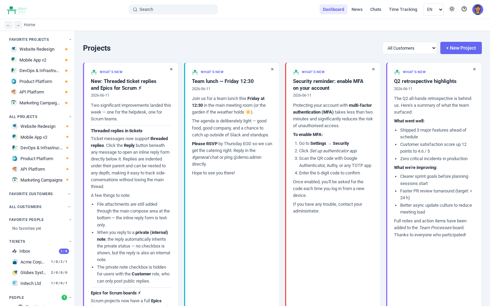
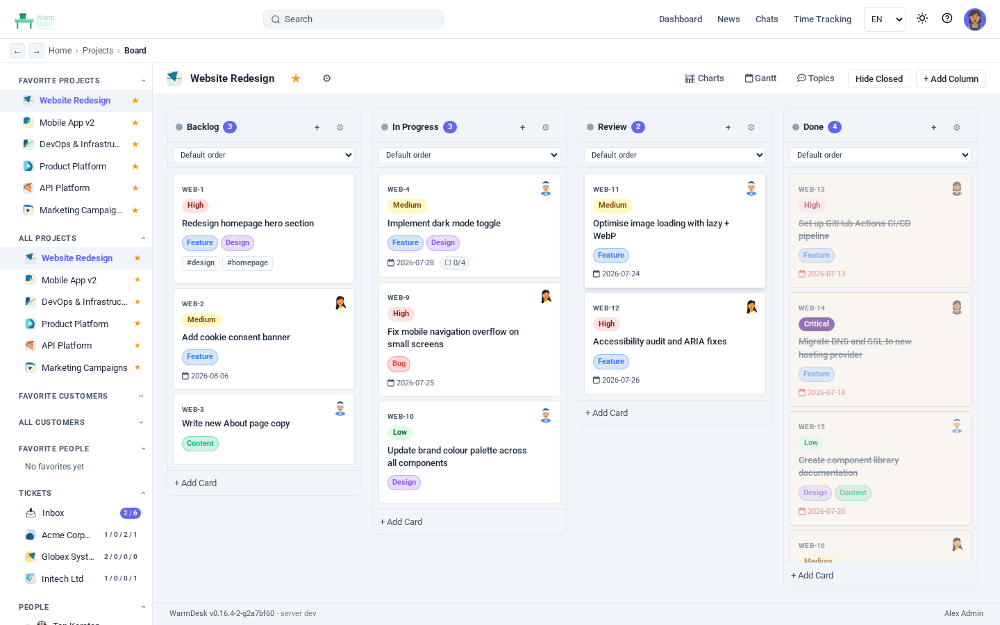
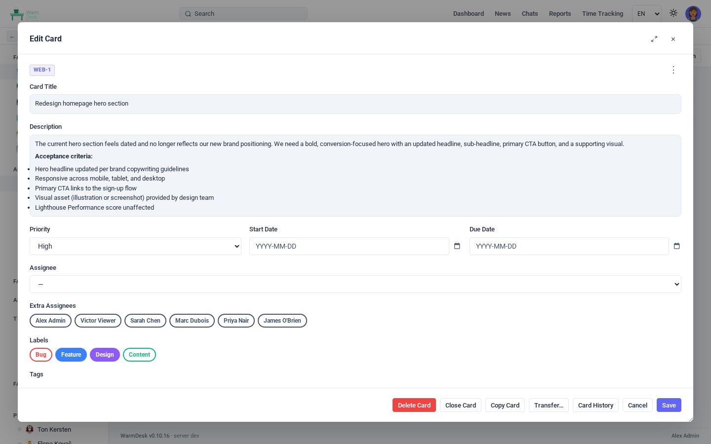
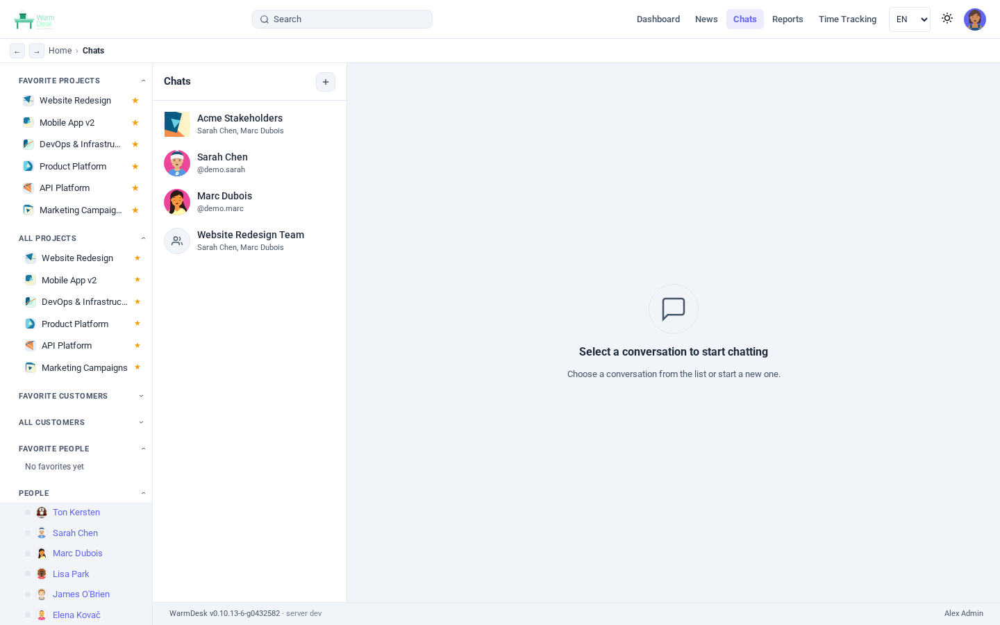
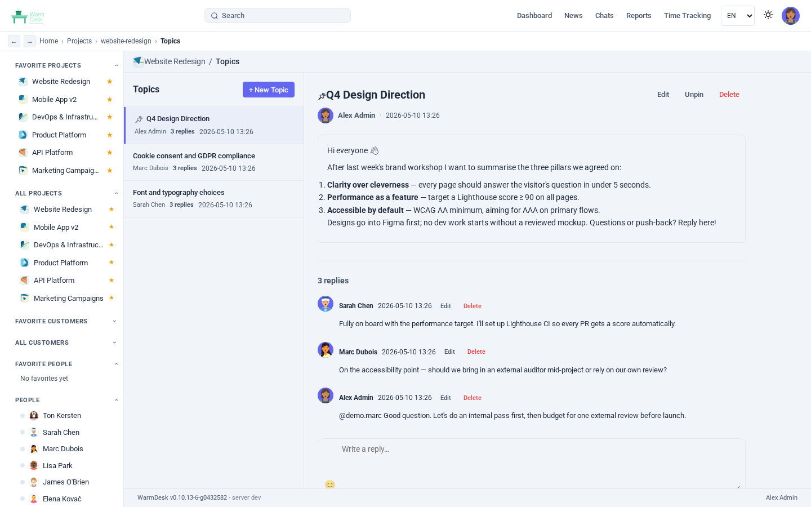
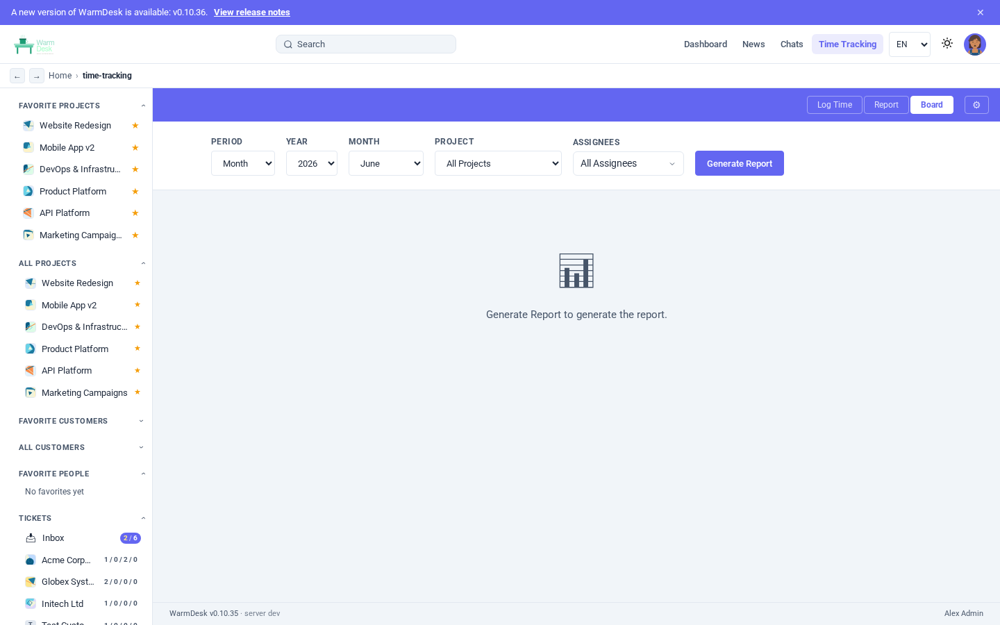
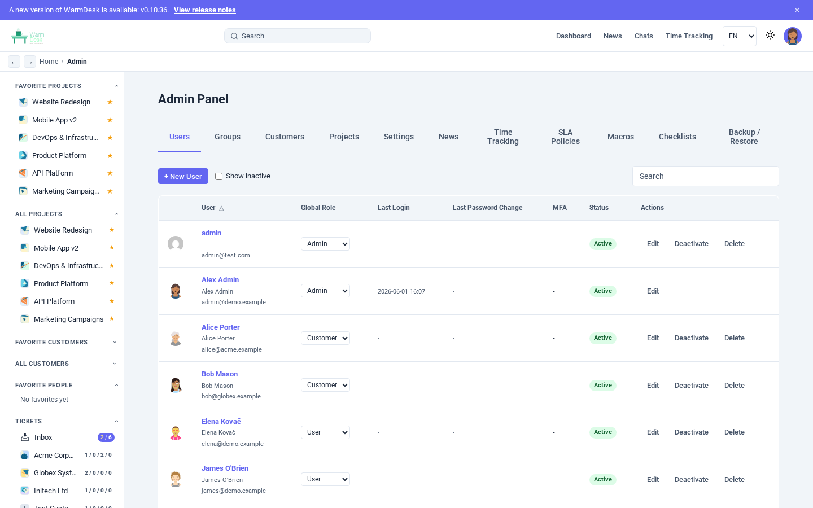
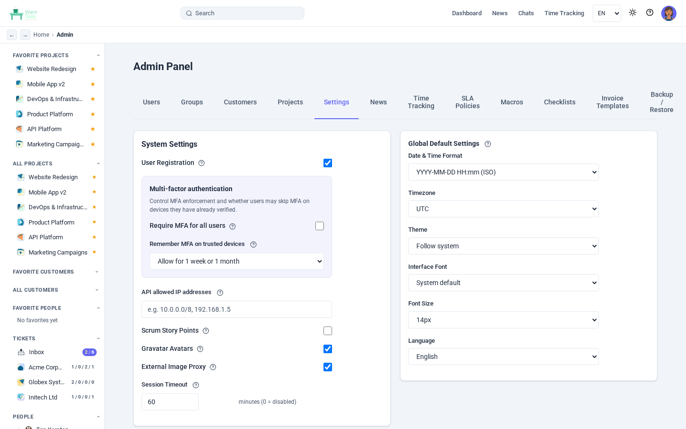
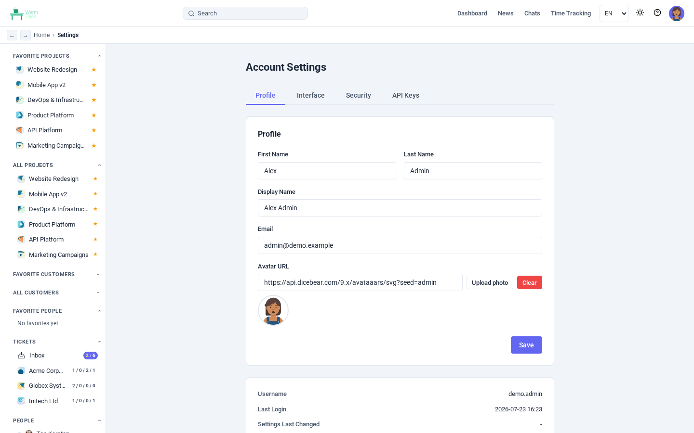

= WarmDesk: Self-Hosted Project Management for Modern Teams
Ton Kersten <t.kersten@atcomputing.nl>
2026-04-26
:doctype: article
:toc: left
:toc-title: Contents
:toclevels: 3
:sectanchors:
:sectlinks:
:icons: font
:imagesdir: images
:figure-caption: Figure
:source-highlighter: highlight.js

Modern software teams produce a constant stream of tasks, conversations, customer commitments, and billable hours.
Most commercial tools that manage all of this run in somebody else's cloud, lock data inside proprietary formats, and charge per seat.
WarmDesk is a self-hosted alternative: a single binary that covers Kanban boards, Scrum sprints, team chat, discussion threads, customer contracts, and time tracking — owned and operated by you.

== What is WarmDesk?

WarmDesk is a project management platform built specifically for teams that require control over their own data.
It ships as a single statically-linked Go binary that contains the REST API, the WebSocket hub, a built-in file server, and a bundled Vue 3 single-page application.

Drop the binary next to a config file, start it, and a fully functional project management tool is immediately available.
No Docker compose files, no Kubernetes manifests, no cloud account required — though all of those deployment models work perfectly fine as well.

.Key properties at a glance
[cols="1,3", options="header"]
|===
|Property |Detail

|Backend
|Go 1.25, Gin, GORM — compiles to a single static binary

|Frontend
|Vue 3 SPA served from the same binary

|Desktop
|Native Tauri 2 app for Linux, macOS, and Windows

|Database
|SQLite (default), PostgreSQL, or MySQL — switch with one config key

|Schema migration
|GORM AutoMigrate on every startup — no separate migration files

|Scaling
|Optional Redis pub/sub enables horizontal multi-instance deployment

|Auth
|JWT (15 min access + 7 day refresh), TOTP/MFA, API keys, role-based access

|i18n
|English, Dutch, German, French, Spanish (extensible)
|===

== Feature Tour

=== Project Boards: Kanban and Scrum

Every project is a board.
At creation time you choose between *Kanban* (columns you define, cards flow freely) and *Scrum* (same columns but with sprints, a backlog, and story points).

.Project dashboard — star, filter by customer, drag-to-reorder

Columns support *WIP limits* — a visual warning appears when a column holds more cards than the configured maximum.
The column ordering is adjusted by dragging; card ordering inside a column is likewise drag-and-drop, persisted immediately through the API.

.Kanban board with drag-and-drop, WIP limit indicators, and a card open in the detail panel

For Scrum projects a sidebar sprint panel lets you create sprints, drag backlog cards into them, and start or complete a sprint with a click.
Completed sprints are retained for historical reference; incomplete cards are returned to the backlog.

=== Cards: The Heart of the System

Every piece of work lives on a card.
Cards support a rich set of metadata:

* *Title* and full *Markdown description* with live preview
* *Priority*: none / low / medium / high
* *Due date* and optional *start date*
* One or more *assignees* (the board renders all their avatars)
* *Labels* (coloured tags defined per project)
* *Tags* (free-form, per card)
* *Story points* for Scrum velocity tracking
* *Time spent* in minutes, logged per comment
* *Checklist items* with individual completion toggles
* *File attachments* (images inline, other types as download links)
* *Watchers* who receive notifications
* *Sub-cards* for hierarchical decomposition
* *Cross-references* (bidirectional _relates-to_ links between cards in any project)
* *Git links* — commits, pull requests, and issues from GitHub, GitLab, Gitea, or Forgejo

The card number (`PRJ-42`) is globally resolvable: typing it in any chat message or comment generates a clickable badge that pops open the card detail.

.Card detail panel with description, checklist, assignees, labels, and comments

=== Gantt View

A per-project Gantt chart visualises cards that have a start date and a due date.
The chart is rendered client-side with Frappe Gantt and lets you quickly spot scheduling conflicts and milestones without leaving the application.

=== Team Chat

Every project has a persistent *project chat* channel.
Members send Markdown-formatted messages, attach files, react with emoji, and @mention colleagues — the mention generates a notification and is highlighted in the recipient's view.

Cross-project *direct messaging* is fully supported: start a 1-on-1 conversation with any user, or create a named group chat by selecting multiple participants (or by picking an entire project team).
Group chats support a custom avatar, member management (add / remove), and five chat layout options — bubble, comfortable, compact, cozy, and grouped (Discord-style).

.Direct messages view with group conversation and layout picker

Messages support link-preview cards (Open Graph metadata is fetched server-side), emoji picker, and desktop notifications.
Messages are delivered over WebSocket; a 5-second polling fallback covers environments where WebSocket is unavailable.

=== Discussion Topics

Each project also has a *topics board* — threaded discussion threads that live alongside the task board.
Topics can be pinned, edited, and replied to; they are a good fit for design decisions, meeting notes, or any asynchronous conversation that does not map to a single card.

.Topics view with pinned topic and replies

=== Customer and Contract Management

WarmDesk adds a lightweight CRM layer.
Every project belongs to a *customer*, and customers can have multiple *contracts* that track start and end dates.

Customer access control is independent of project membership: a user can be granted access to all projects under a customer without being explicitly added to each one.
*User groups* provide the same shortcut at scale — assign a group to a customer or project once, and all group members inherit the role.

Customers can be starred for quick access, filtered in the project dashboard, and viewed with their full project and contract history.

=== Time Tracking and Reporting

Time entries are recorded against a project and optionally against a specific customer.
Each week displays as a grid of date columns and project rows; clicking a cell opens a duration + description entry.
Time can also be logged directly on a card comment with a `time_spent_minutes` value.

.Weekly time tracking view

The *Reports* view aggregates entries across any combination of date range, user, customer, and project.
Reports export to *PDF* (rendered via Go's gofpdf library, or via `window.print()` with print-specific CSS in the browser) and to *XLSX* (SheetJS).

=== Administration

An admin panel covers:

* **User management** — create, edit, deactivate, reset MFA, and assign global roles
* **Group management** — define user groups and assign them to projects and customers in bulk
* **Project management** — view, archive, restore, and permanently delete projects
* **System settings** — SMTP, locale defaults, session timeout, registration toggle, branding
* **Database backup** — on-demand or scheduled backup with download and restore via the UI

.Admin panel — users tab

.Admin panel — system settings

Global roles control platform-level access beyond individual projects:

[cols="1,3", options="header"]
|===
|Role |Capabilities

|`admin`
|Full access to all projects, customers, users, and system settings

|`user`
|Can create projects, manage their own projects, access assigned resources

|`viewer`
|Read-only access to assigned projects and customers

|`metrics`
|Read-only access to the Prometheus `/metrics` endpoint

|`backup`
|Can trigger and download backups via the API
|===

=== Git and CI/CD Integration

Three complementary mechanisms bridge WarmDesk and source control:

**Incoming webhooks** — each project can register webhook endpoints for GitHub, GitLab, or Gitea/Forgejo.
Push events, pull request events, and issue events are parsed and linked to cards when the payload matches a card reference (`PRJ-42`).
The link appears in the card's _Links_ tab with status, author, and URL.

**Ticket API** — a stable `X-API-Key`-authenticated endpoint allows CI pipelines to create cards, add comments, and move cards between columns without a user session.
This is useful for automatically filing a card when a security scan finds a new vulnerability, or for transitioning a card to "Done" when a deployment succeeds.

**Webhook receiver for chat** — a generic JSON webhook posts a formatted message to the project's chat channel, enabling simple status notifications from any tool that can make an HTTP POST.

=== User Preferences and Personalisation

Every user controls their own:

* *Theme* — light, dark, or follow the OS
* *Language* — twelve languages in the current release (en, nl, de, fr, es, da, sv, nb, fi, is, pt, it)
* *Date/time format* and *timezone*
* *Font* and *font size*
* *Sidebar position* (left or right)
* *Accent colour*
* *TOTP MFA* (enable / disable from the profile settings page)
* *Personal API keys* for automating individual workflows

.User settings — profile and appearance

== Architecture

=== Application Stack

image::architecture.svg[Architecture overview, 820]

The frontend is a Vue 3 SPA bundled by Vite.
In development, Vite's dev server runs on port 5173 and proxies `/api` calls to the Go backend on port 8080.
In production, the Go binary serves the compiled frontend from the path configured in `web_dir`.

The backend exposes a REST API under `/api/v1/` and two WebSocket endpoints: `/api/v1/ws/:projectSlug` for project-level events (card updates, chat, presence) and `/api/v1/ws/user` for user-level events (DM notifications, mentions).
All WebSocket state is kept in an in-process hub per project; swapping the hub's pub/sub layer to Redis enables horizontal deployment across multiple backend instances with no code change.

The Tauri 2 desktop app wraps the same Vue 3 frontend in a native window.
It uses the Tauri HTTP plugin to reach a locally running WarmDesk backend, or a remote one over HTTPS.

=== Backend Code Layout

[source]
----
backend/
  main.go            # startup: config, DB, services, router
  config/            # Config struct + env var / YAML loading
  database/          # GORM init, AutoMigrate for all models
  handlers/          # One file per feature area
  middleware/        # JWT auth, AdminOnly, APIKeyAuth, CORS
  models/            # GORM model structs
  router/            # All routes registered in one file
  services/          # Business logic (auth, ordering, access control)
  ws/                # WebSocket hub + client + pub/sub
----

Handlers follow a strict pattern: parse and validate path parameters, check project membership with `services.RequireProjectRole`, bind the JSON body, perform the DB operation, broadcast a WebSocket event if needed, return JSON.
Every error response uses the same shape: `{ "error": "human readable message" }`.

=== Frontend Code Layout

[source]
----
frontend/src/
  api/           # Axios wrappers, one file per domain
  components/    # Reusable Vue components
  composables/   # useTheme, useWebSocket, useDateFormat, useAvatar …
  i18n/          # 12 language files (en, nl, de, fr, es, da, sv, nb, fi, is, pt, it)
  router/        # All routes + auth guards
  stores/        # Pinia stores (auth, board, chat, project, ui …)
  styles/        # CSS custom properties for light and dark themes
  views/         # Page-level Vue components
----

Pinia stores own all shared state; components only read from stores and dispatch actions.
The `board.js` store is the most complex: it owns columns and cards, applies WebSocket deltas, and handles drag-drop reordering.
`useWebSocket.js` establishes one connection per project view and routes incoming messages to the correct store by type prefix (`board.*`, `chat.*`, `topic.*`, `presence.*`).

== Data Model

The diagram below shows the core entities and their relationships.
Solid lines are 1:N foreign keys; dashed purple lines are M:N join tables.

image::erd.svg[Core data model, 1050]

=== Key Design Decisions

**AutoMigrate instead of migration files** +
Every model struct carries GORM tags.
On startup the database is opened and `AutoMigrate` is called for every model.
Adding a new column to a feature means adding a field with a `gorm:"default:..."` tag — the column appears on the next restart with no manual intervention.

**Fractional position ordering** +
Cards, columns, and projects store their display order as a `float64 position` rather than an integer index.
Inserting a card between positions 1.0 and 2.0 gives it position 1.5 — no bulk re-numbering query is needed.
Positions are normalised (renumbered as 1.0, 2.0, 3.0 …) after any reorder API call to prevent precision exhaustion.

**Card numbering** +
Each project has an atomic `card_counter` column.
Creating a card does `UPDATE projects SET card_counter = card_counter + 1` and reads the new value — the card gets number `KeyPrefix-N` without a separate sequence object, keeping the schema compatible with SQLite.

**System settings as key-value rows** +
SMTP credentials, branding, locale defaults, and other admin-controlled settings are stored as rows in the `system_settings` table.
They are read at request time so changes take effect without a restart.

**WebSocket fan-out** +
The in-process hub keeps one Go channel per connected client.
When a handler calls `ws.BroadcastToProject(projectID, msg)`, the hub iterates the channel set for that project and delivers the JSON message.
When `redis_url` is configured, publish/subscribe uses Redis channels instead so that multiple backend instances can fan out to all connected clients regardless of which instance they are connected to.

== API Design

The REST API follows predictable conventions.

=== Route Structure

Every project-scoped operation is nested under `/api/v1/projects/:projectSlug/`.
The slug is URL-safe and derived from the project name on creation.

[source]
----
GET    /api/v1/projects/:slug/columns/:colId/cards      # list cards
POST   /api/v1/projects/:slug/columns/:colId/cards      # create card
GET    /api/v1/projects/:slug/cards/:cardId             # get card detail
PUT    /api/v1/projects/:slug/cards/:cardId             # update card
PATCH  /api/v1/projects/:slug/cards/:cardId/move        # move to column
DELETE /api/v1/projects/:slug/cards/:cardId             # soft-delete
----

=== Authentication

All protected routes require a `Bearer <token>` header.
The access token (15 minutes) is obtained from `POST /api/v1/auth/login`.
The frontend silently refreshes it using the 7-day refresh token; a 401 response triggers a transparent re-authentication cycle.

API keys use `X-API-Key: <key>` or `?api_key=<key>` and are intended for CI/CD pipelines and automation scripts.

=== Webhook Receivers

Incoming webhooks authenticate via a token embedded in the URL path:

[source]
----
POST /api/v1/github-webhook/:token
POST /api/v1/gitlab-webhook/:token
POST /api/v1/gitea-webhook/:token
POST /api/v1/webhooks/:token          # generic JSON
----

The token is scoped to a single project; the receiver parses the payload, extracts card references, and creates `CardLink` records.

=== Prometheus Metrics

`GET /api/v1/metrics` exposes a standard Prometheus scrape endpoint, accessible to users with the `metrics` or `admin` global role.

=== Swagger UI

`GET /swagger/index.html` provides an interactive API browser generated from Go annotations with swaggo/swag.

== Deployment

=== Minimum Setup

[source,bash]
----
# Download the release binary for your platform
wget https://example.org/warmdesk-linux-amd64

# Optional: create a minimal config file
cat > warmdesk.yaml <<EOF
port: 8080
jwt_secret: change-this-in-production
EOF

# Run (creates warmdesk.db on first start)
./warmdesk
----

Open `http://localhost:8080`, register the first user, and promote them to admin with a direct DB update — or use another admin account once the first admin exists.

=== Database Selection

[source,yaml]
----
# SQLite (default — no extra setup)
db_driver: sqlite
db_dsn: ./warmdesk.db

# PostgreSQL
db_driver: postgres
db_dsn: host=db user=warmdesk password=secret dbname=warmdesk sslmode=disable

# MySQL / MariaDB
db_driver: mysql
db_dsn: warmdesk:secret@tcp(db:3306)/warmdesk?charset=utf8mb4&parseTime=True
----

=== systemd Service

The `deploy/` directory ships ready-to-use templates:

[source,bash]
----
deploy/
  warmdesk.service        # systemd unit
  nginx.conf              # reverse proxy with SSL termination
  apache.conf             # Apache alternative
----

=== Horizontal Scaling

Add Redis and point multiple instances at the same database:

[source,yaml]
----
redis_url: redis://redis-host:6379/0
db_driver: postgres
db_dsn: host=pg-primary user=warmdesk ...
----

Each instance runs an independent WebSocket hub; Redis pub/sub bridges them so that a card update from a user connected to instance A is broadcast to users connected to instance B.

=== AppImage and Native Packages

The Makefile provides build targets for redistribution:

[source,bash]
----
make appimage          # Linux AppImage (requires Rust + system libs)
make dmg               # macOS universal DMG
make windows-installer # Windows NSIS installer
----

These wrap the Tauri 2 desktop app, which bundles its own WebView and communicates with a locally running (or remote) WarmDesk backend.

== Summary

WarmDesk brings together the features a small-to-medium engineering team actually needs — Kanban and Scrum boards, real-time chat, customer management, time tracking, and Git integration — in a package that fits on a single server, scales horizontally when traffic grows, and keeps every byte of project data under your own control.

Its architecture is deliberately boring: a Go binary, a Vue SPA, a database.
No external services required out of the box, no per-seat pricing, no vendor lock-in.

The source code, Ansible collection, and deployment templates are all available in the repository.

== Links

* Repository: link:https://github.com/atcomputing/warmdesk[github.com/atcomputing/warmdesk]
* Ansible Galaxy collection: `ansilabnl.warmdesk`
* API documentation: `/swagger/index.html` on any running instance
* Installation guide: link:../INSTALL.md[INSTALL.md]
* Admin guide: link:admin-guide.md[admin-guide.adoc]
